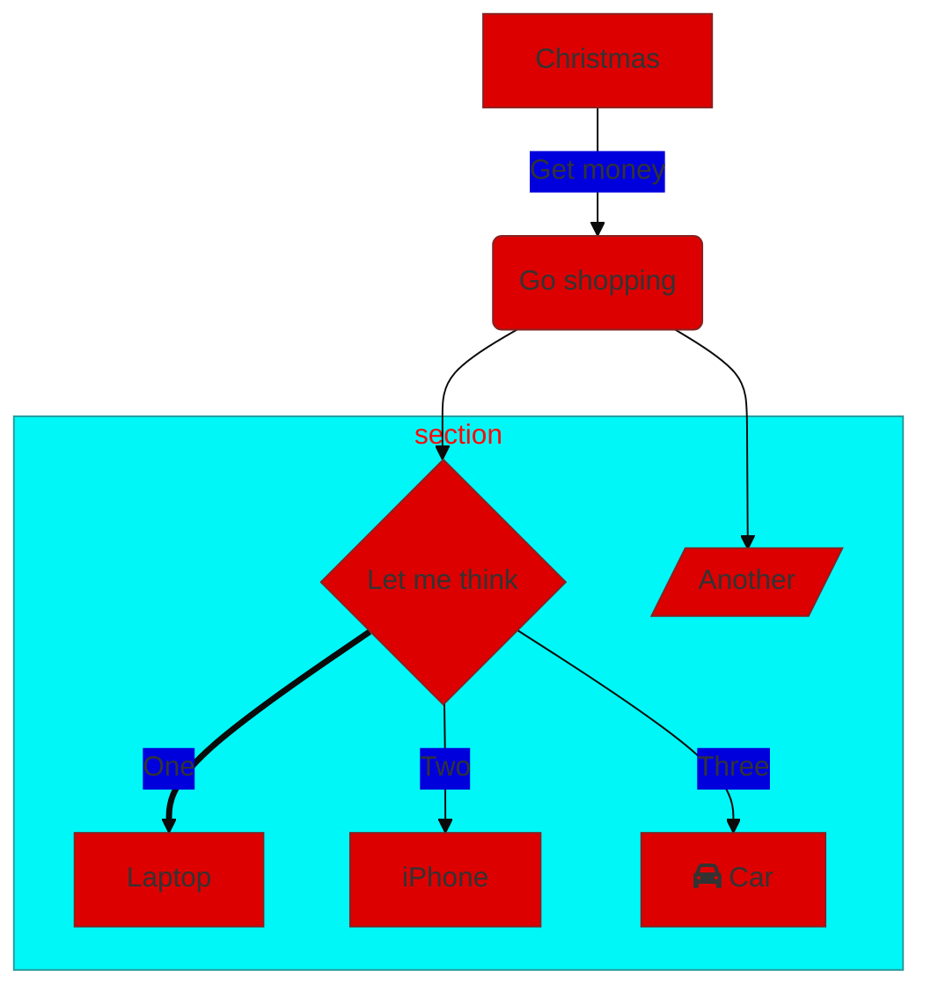

# Mermaid Html Dokka plugin

## Step 1: install

```kotlin
dependencies {
  dokkaPlugin("com.glureau:html-mermaid-dokka-plugin:0.2.2")
}
```

## Step 2: put your Mermaid graphs in your code comments.

```kotlin
    /**
     * See the graph for more details:
     * ```mermaid
     * graph LR
     *   A[Christmas] -->|Get money| B(Go shopping)
     *   B --> C{Let me think}
     *   C -->|One| D[Laptop]
     *   C -->|Two| E[iPhone]
     *   C -->|Three| F[fa:fa-car Car]
     * ```
     * another one
     * ```mermaid
gantt
    title A Gantt Diagram
    dateFormat  YYYY-MM-DD
    section Section
    A task           :a1, 2014-01-01, 30d
    Another task     :after a1  , 20d
    section Another
    Task in sec      :2014-01-12  , 12d
    another task      : 24d
    * ```
*/
class CompositeSubscription
```

## Step 3: enjoy your Dokka documentation

`./gradlew dokkaHtml`


<<<<<<< HEAD

# Theming & customization

By default, the [Mermaid themes](https://github.com/mermaid-js/mermaid/blob/develop/docs/theming.md#deployable-themes) used are `default` and `dark`, but you can override themes globally with:

```kotlin
tasks.dokkaHtmlMultiModule {
    pluginsMapConfiguration.set(
        mapOf(
            "com.glureau.HtmlMermaidDokkaPlugin" to """
                {
                    "lightTheme": "forest",
                    "darkTheme": "dark"
                }
            """.trimIndent()
        )
    )
}
```

You can also specify the theme by graph, with the `%%{init: ...}%%` block ([documentation](https://github.com/mermaid-js/mermaid/blob/develop/docs/theming.md#customizing-themes--with-themevariables)).

For example with `%%{init: {'theme': 'base', 'themeVariables': { 'primaryColor': '#DD0000'}}}%%`

=======
>>>>>>> main
