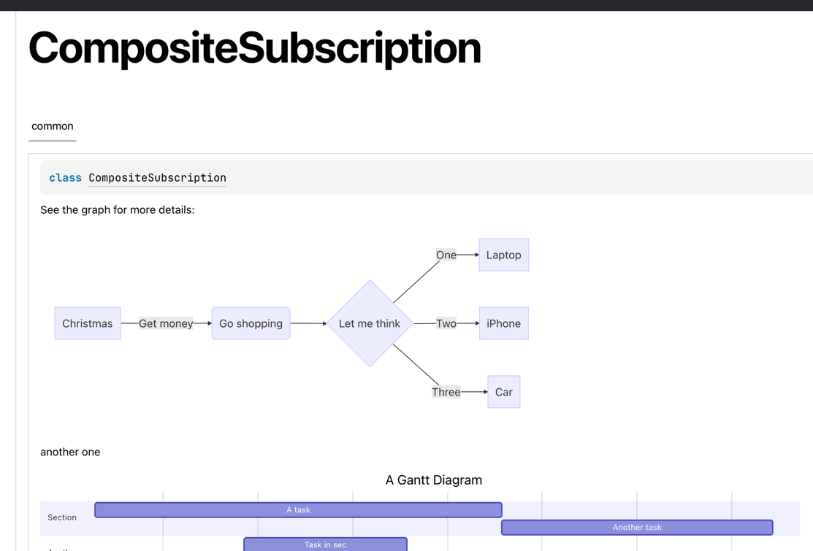
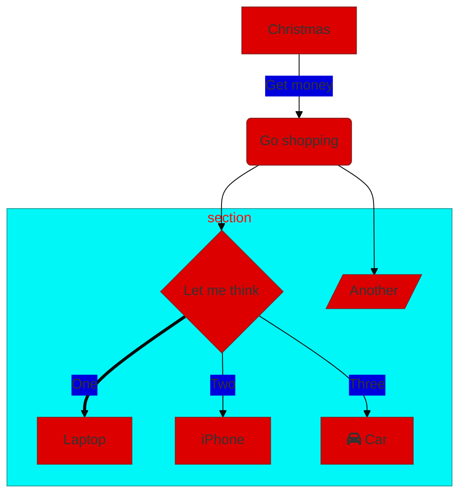

# Html [Mermaid](https://mermaid-js.github.io/mermaid/#/) Dokka plugin

| Mermaid-Dokka | Dokka  | MermaidJS                                                           |
|:-------------:|:------:|:--------------------------------------------------------------------|
|     0.2.2     | 1.6.0  | [8.14.0](https://github.com/mermaid-js/mermaid/releases/tag/8.14.0) |
|     0.3.0     | 1.6.0  | [9.0.0](https://github.com/mermaid-js/mermaid/releases/tag/9.0.0)   |
|     0.3.1     | 1.6.0  | [9.1.0](https://github.com/mermaid-js/mermaid/releases/tag/9.1.0)   |
|     0.3.2     | 1.6.0  | [9.1.2](https://github.com/mermaid-js/mermaid/releases/tag/9.1.2)   |
|     0.3.3     | 1.6.0  | [9.1.7](https://github.com/mermaid-js/mermaid/releases/tag/v9.1.7)  |
|     0.4.0     | 1.7.20 | [9.1.7](https://github.com/mermaid-js/mermaid/releases/tag/v9.1.7)  |
|     0.4.1     | 1.7.20 | [9.2.0](https://github.com/mermaid-js/mermaid/releases/tag/v9.2.0)  |

## Step 1: install

```kotlin
dependencies {
    dokkaPlugin("com.glureau:html-mermaid-dokka-plugin:0.4.1")
}
```

## Step 2: write [Mermaid](https://mermaid-js.github.io/mermaid/#/) graphs

You can write them on markdown files
for [modules/packages](https://kotlinlang.org/docs/kotlin-doc.html#module-and-package-documentation) or directly from
any comment in your code.

```kotlin
    /**
 * See the graph for more details:
 * ```mermaid
 * graph LR
 *   A[Christmas] -->|Get money| B(Go shopping)
 *   B --> C{Let me think}
 *   C -->|One| D[Laptop]
 *   C -->|Two| E[iPhone]
 *   C -->|Three| F[fa:fa-car Car]
 * ```

* another one
* ```mermaid

gantt
title A Gantt Diagram
dateFormat YYYY-MM-DD
section Section
A task           :a1, 2014-01-01, 30d
Another task     :after a1 , 20d
section Another
Task in sec      :2014-01-12 , 12d
another task      : 24d

* ```

*/
class CompositeSubscription

```

## Step 3: enjoy your Dokka documentation

`./gradlew dokkaHtml` or `./gradlew dokkaHtmlMultiModule` ->



# Theming & customization

By default, the [Mermaid themes](https://github.com/mermaid-js/mermaid/blob/develop/docs/theming.md#deployable-themes)
used are `default` and `dark`, but you can override themes globally with:

```kotlin
tasks.dokkaHtmlMultiModule {
    pluginsMapConfiguration.set(
        mapOf(
            "com.glureau.HtmlMermaidDokkaPlugin" to """
                {
                    "lightTheme": "forest",
                    "darkTheme": "dark"
                }
            """.trimIndent()
        )
    )
}
```

You can also specify the theme for each graph, with the `%%{init: ...}%%`
block ([documentation](https://github.com/mermaid-js/mermaid/blob/develop/docs/theming.md#customizing-themes--with-themevariables))
.

For example with `%%{init: {'theme': 'base', 'themeVariables': { 'primaryColor': '#DD0000'}}}%%`


